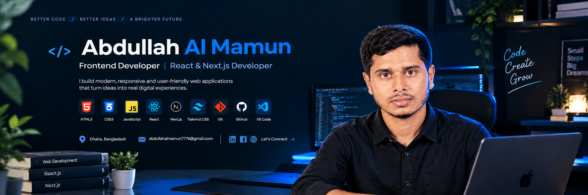

<!-- ========================= -->
<!--        PROFILE BANNER     -->
<!-- ========================= -->

  

<!-- ========================= -->
<!--          INTRO            -->
<!-- ========================= -->

<h1 align="center">Hi 👋, I'm Abdullah Al Mamun</h1>

<h3 align="center">
  Frontend Developer | React & Next.js Developer
</h3>

  Building clean, responsive & user-friendly web experiences.

  
  
  

---

## 👨‍💻 About Me

I'm a passionate **Frontend Developer** focused on creating clean, responsive, and user-friendly web applications.

I enjoy transforming ideas and designs into functional web experiences and continuously improving my development skills through hands-on projects.

- 💻 Focused on Frontend Web Development
- ⚛️ Working with React and modern JavaScript
- 🚀 Exploring Next.js and modern web technologies
- 🎨 Interested in clean UI, responsive design, and UX
- 🔧 Building real-world projects to improve my skills
- 📚 Always learning and improving my coding workflow

---

## 🚀 Current Activities

- 🔹 Building responsive React applications
- 🔹 Exploring Next.js and App Router
- 🔹 Practicing API integration
- 🔹 Working with Tailwind CSS
- 🔹 Improving JavaScript and React skills
- 🔹 Practicing Git & GitHub workflow
- 🔹 Deploying projects with Vercel

---

# 🛠️ Skills & Technologies

### 🎨 Frontend Development

  

### 🔧 Tools & Technologies

  

---

# 📌 Featured Projects

## 🏋️ Fit Log

A responsive workout library and workout planning application built with **Next.js, React, Tailwind CSS, and REST API**.

### ✨ Features

- Responsive user interface
- Workout library
- Workout planning functionality
- API integration
- Modern responsive design

### 🛠️ Tech Stack

`Next.js` `React` `JavaScript` `Tailwind CSS` `REST API`

🔗 **Live Website:**  
https://b14-a6-fit-log-tawny.vercel.app/

🔗 **GitHub Repository:**  
https://github.com/abdullahmamun-docs-dev/B14-A6-Fit-Log

---

## 🎬 Movie Explorer

A responsive movie discovery application built with **React, JavaScript, Tailwind CSS, and the TVMaze REST API**.

### ✨ Features

- 🔎 Search movies and TV shows
- 🎬 Browse movie/show information
- 📱 Fully responsive design
- 🌐 REST API integration
- ⚡ Dynamic data loading
- 🎨 Clean and user-friendly interface

### 🛠️ Tech Stack

`React` `JavaScript` `Tailwind CSS` `REST API` `TVMaze API`

🔗 **GitHub Repository:**  
https://github.com/abdullahmamun-docs-dev/movie-explorer

> 🌐 Live Demo link can be added here after the project is deployed.

---

# 📊 GitHub Statistics

  

  

# 🔥 Contribution Streak

  

---

# 🐍 Contribution Activity

  

---

# 🌐 Connect With Me

---

# 📫 Contact

📍 **Location:** Dhaka, Bangladesh

📧 **Email:**  
abdullahalmamun7776@gmail.com

💻 **GitHub:**  
https://github.com/abdullahmamun-docs-dev

---

  ⭐ Thanks for visiting my profile!

  <b>Keep Learning • Keep Building • Keep Growing 🚀</b>

